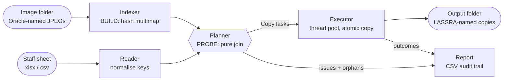

# Oracle → LASSRA Photo Renamer

A Python tool that takes a folder of staff passport photos named by **Oracle number**, looks each one up in a staff Excel/CSV sheet, and saves a copy named by the staff member's **LASSRA number** into a new folder. Every row and every image is accounted for in a CSV report.

This single document contains everything needed to build, understand, and run the project:

1. [README](#1-readme)
2. [System architecture](#2-system-architecture)
3. [Architecture Decision Records (ADRs)](#3-architecture-decision-records)
4. [Algorithm logic](#4-algorithm-logic)
5. [DSA rules the system follows](#5-dsa-rules-the-system-follows)


---

## 1. README

### What it does

| Input | Example |
|---|---|
| Image folder | `photos/102345.jpg`, `photos/102346.JPEG` |
| Staff sheet (`.xlsx` or `.csv`) | `Oracle No`, `LASSRA No`, `Name`, bio data… |

| Output | Example |
|---|---|
| Renamed photos (copies) | `renamed/LAS0000123.jpg` |
| Run report | `renamed/rename_report_20260928_103000.csv` |

The original photos are **never modified or moved**.

### Requirements

- Python 3.9+
- `openpyxl` (for `.xlsx` sheets)

### Quick start

```bash
# 1. Set up
python -m venv .venv
source .venv/bin/activate          # Windows: .venv\Scripts\activate
pip install -r requirements.txt

# 2. Preview first (writes the report, copies nothing)
python -m oracle_renamer --images ./photos --sheet ./staff.xlsx --out ./renamed --dry-run

# 3. Real run
python -m oracle_renamer --images ./photos --sheet ./staff.xlsx --out ./renamed
```

Then open the report CSV in Excel and filter the `status` column for anything that isn't `RENAMED`.

### Command-line options

| Option | Default | Purpose |
|---|---|---|
| `--images PATH` | required | Folder of Oracle-named `.jpg`/`.jpeg` photos |
| `--sheet PATH` | required | Staff data file (`.xlsx` or `.csv`) |
| `--out PATH` | required | Output folder (created if missing) |
| `--report PATH` | `<out>/rename_report_<timestamp>.csv` | Where to write the report |
| `--oracle-col` | `Oracle No` | Header of the Oracle number column |
| `--lassra-col` | `LASSRA No` | Header of the LASSRA number column |
| `--name-col` | `Name` | Header of the name column (optional; used in the report) |
| `--sheet-name` | first sheet | Worksheet to read in an `.xlsx` file |
| `--strip-leading-zeros` | off | Treat `00123` and `123` as the same Oracle number |
| `--recursive` | off | Also scan subfolders of `--images` |
| `--dry-run` | off | Plan and report without copying anything |
| `--overwrite` | off | Replace a *different* file already at the destination |
| `--verify-hash` | off | Use SHA-256 (not just file size) to detect already-copied files |
| `--workers N` | `8` | Parallel copy threads |
| `-v`, `--verbose` | off | Debug logging |

Column headers are matched ignoring case, spaces, and punctuation, so `Oracle No`, `ORACLE NO.`, and `oracle_no` all work.

### Report statuses

Every staff row gets **exactly one** status. Images no row claimed are listed at the end.

| Status | Meaning | What to do |
|---|---|---|
| `RENAMED` | Photo copied to `<LASSRA>.jpg` | Nothing |
| `PLANNED` | Dry run: would be copied | Run without `--dry-run` |
| `ALREADY_DONE` | Identical file already in output (rerun) | Nothing |
| `BLANK_ORACLE` | Row has no Oracle number | Fill it in the sheet |
| `BLANK_LASSRA` | Row has no LASSRA number | Fill it in the sheet |
| `INVALID_LASSRA` | LASSRA has characters illegal in filenames (`/ \ : * ? " < > \|`) | Correct the value |
| `DUPLICATE_ORACLE` | Same Oracle number on 2+ rows (all are skipped) | Find the wrong row |
| `DUPLICATE_LASSRA` | Same LASSRA number on 2+ rows (all are skipped) | Find the wrong row |
| `NO_PHOTO` | No image with this Oracle number | Locate or retake the photo |
| `DUPLICATE_IMAGE` | 2+ images share this Oracle number | Delete the wrong one |
| `TARGET_CONFLICT` | A *different* file already has the output name | Check it, or use `--overwrite` |
| `COPY_FAILED` | OS error while copying (details in report) | Check permissions/disk space |
| `ORPHAN_IMAGE` | Image that no staff row references | Check whether a row is missing |

### Exit codes

| Code | Meaning |
|---|---|
| `0` | Every row ended as `RENAMED`, `PLANNED`, or `ALREADY_DONE` |
| `1` | Fatal error (missing folder, missing column, bad arguments) |
| `2` | Run finished, but some rows need attention (see report) |

### Project structure

```
oracle-renamer/
├── oracle_renamer/
│   ├── __init__.py      # package metadata
│   ├── __main__.py      # enables `python -m oracle_renamer`
│   ├── models.py        # dataclasses + Status enum (stage contracts)
│   ├── keys.py          # key normalisation (the correctness core)
│   ├── indexer.py       # BUILD phase: folder -> hash multimap
│   ├── reader.py        # read + normalise the staff sheet
│   ├── planner.py       # PROBE phase: pure join logic, no I/O
│   ├── executor.py      # parallel, atomic, idempotent copies
│   ├── report.py        # CSV audit trail + summary
│   └── cli.py           # argument parsing + orchestration
├── tests/
│   └── test_pipeline.py
├── requirements.txt
└── requirements-dev.txt
```

### Running the tests

```bash
pip install -r requirements-dev.txt
pytest -q
```

The suite covers key normalisation, every planner status, dry run, idempotent reruns, conflict protection, and fatal errors (15 tests).

### Safe to rerun

If a run is interrupted (power cut, closed laptop), just run the same command again. Files already copied are detected as `ALREADY_DONE` and skipped, and half-written files are never left under a real LASSRA name.

---

## 2. System architecture



| Stage | Module | Reads disk | Writes disk | Complexity |
|---|---|---|---|---|
| Index images | `indexer.py` | yes (directory listing only) | no | O(m) |
| Read sheet | `reader.py` | yes | no | O(n) |
| Build plan | `planner.py` | **no** | **no** | O(n + m) |
| Execute copies | `executor.py` | yes | yes | O(total bytes) / workers |
| Write report | `report.py` | no | yes | O(n log n + m) |

*n* = staff rows, *m* = image files.

Each stage talks to the next only through the small dataclasses in `models.py` (`ImageIndex`, `StaffRow`, `Plan`, `CopyTask`, `ReportEntry`), so any stage can be replaced independently. For example, a web UI could reuse the indexer, reader, planner, and executor unchanged and only replace `cli.py`.

---

## 3. Architecture Decision Records

### ADR-001: Use a hash join to match rows to images

**Status:** Accepted

**Context.** The original process loops over staff rows and searches the folder for each one. That is a nested loop, O(n × m). For a state workforce of ~50,000 staff, that is about 2.5 billion comparisons.

**Options considered**

| Option | Time | Extra space | Notes |
|---|---|---|---|
| Nested loop | O(n × m) | O(1) | Unusable beyond a few thousand staff |
| Sort both + binary search | O(m log m + n log m) | O(m) | Works; sorting is wasted effort |
| Sort-merge join | O(n log n + m log m) | O(n + m) | Best when data is too big for RAM |
| **Hash join** | **O(n + m)** | **O(m)** | Linear; index is tiny (short key → path) |

**Decision.** Build a dict from normalised Oracle number to image path(s) in one folder scan, then probe it once per row.

**Consequences.** Matching becomes negligible next to file I/O. Memory grows with the image count, but 1 million entries is only a few hundred MB. If the index ever outgrows RAM, switch to SQLite with an index on `oracle_no`, or to a sort-merge join (see §4, scaling).

---

### ADR-002: Separate a pure planner from the I/O executor

**Status:** Accepted

**Context.** Mixing decision logic with file copying makes the code hard to test, and "dry run" would need its own separate code path.

**Decision.** `planner.py` takes in-memory data and returns a `Plan` without touching the disk. `executor.py` only performs `CopyTask`s.

**Consequences.**
- Dry run and real runs share exactly the same decision logic; only the executor behaves differently.
- The planner is unit-tested with plain dicts and lists, no temp files.
- Adds one intermediate structure (`Plan`) in memory, O(n).

---

### ADR-003: Copy, never move; write atomically

**Status:** Accepted

**Context.** These are identity photos. A bug or a wrong spreadsheet must never destroy the originals, and a crash must never leave a half-written photo under a real LASSRA name.

**Decision.**
- Use `shutil.copy2`, never `rename`/`move`, and refuse to run if `--out` equals `--images`.
- Copy to `<name>.part`, then `os.replace()` into the final name, which is atomic on the same filesystem.

**Consequences.** Needs roughly double the disk space during a run. In exchange, any run can be abandoned and repeated with zero risk to the source data.

---

### ADR-004: One normalisation function for both sides of the join

**Status:** Accepted

**Context.** Hash lookups need byte-identical keys, but real data doesn't cooperate. Excel stores `102345` as the float `102345.0`, cells carry stray spaces, and files can be named `102345.JPG`. Leading zeros are ambiguous: Excel may have dropped them (so `00123` should equal `123`), or they may be significant.

**Decision.**
- `keys.normalise_key()` is the **only** way a key enters or probes the index.
- Canonical form: text, internal whitespace removed, upper-cased, float artefacts (`.0`) removed.
- Leading-zero stripping is **opt-in** (`--strip-leading-zeros`), because silently merging two different fixed-width IDs is worse than reporting a `NO_PHOTO`.
- File extensions are compared case-insensitively.

**Consequences.** Missed matches from formatting noise are eliminated. Users whose data has lost leading zeros must turn on the flag, and the README explains when to do so.

---

### ADR-005: Reject all rows in a duplicate group, not "first one wins"

**Status:** Accepted

**Context.** If two rows share an Oracle number, one of them is wrong, but the tool can't know which. A streaming "first row wins" approach would give the photo to whichever row happens to come first, which silently attaches a face to the wrong ID.

**Options.** (a) first wins, streaming, O(1) extra memory; (b) last wins; (c) **count first, then skip every member of a duplicate group**.

**Decision.** Option (c). Pass 1 counts Oracle and LASSRA numbers with `Counter` (O(n)). Pass 2 skips any row whose key count is above 1 and reports it.

**Consequences.** Rows must be held in memory, O(n). A `StaffRow` is a few short strings, so this is tens of MB even at 500k rows. Correctness of identity data outweighs that cost. LASSRA duplicates are counted **case-insensitively**, because `AB12.jpg` and `ab12.jpg` are the same file on Windows and macOS.

---

### ADR-006: Keep the source extension (lower-cased)

**Status:** Accepted

**Context.** `.jpg` and `.jpeg` are the same format. Renaming the extension is cosmetic, and re-encoding would degrade photo quality.

**Decision.** The output is `<LASSRA><source extension, lower-cased>`, with no image processing.

**Consequences.** The output may mix `.jpg` and `.jpeg`. If a downstream system later demands one extension, add a flag; that is a one-line change in `planner.py`.

---

### ADR-007: Thread pool for copies

**Status:** Accepted

**Context.** After ADR-001, CPU work is trivial and the run is bound by disk and network latency. Python releases the GIL during file I/O.

**Options.** Sequential copies; `multiprocessing`; `asyncio`; **`ThreadPoolExecutor`**.

**Decision.** Use a bounded `ThreadPoolExecutor` (default 8 workers, configurable with `--workers`). Results are applied on the main thread, so the shared `Plan` needs no locks.

**Consequences.** Near-linear speedup on SSDs and network shares. Too many workers can thrash a slow USB drive, which is why the pool is bounded and configurable. Each task catches its own `OSError`, so one bad file can't abort the run.

---

### ADR-008: Idempotent reruns

**Status:** Accepted

**Context.** Long runs on shared machines get interrupted.

**Decision.** Before copying, check the destination:
- If it's the same file (same size, plus the same SHA-256 when `--verify-hash` is set), mark it `ALREADY_DONE`.
- If it's a different file, mark it `TARGET_CONFLICT`, unless `--overwrite` is set.
- If it's missing, copy it.

**Consequences.** Rerunning the same command resumes safely. The size-only check is O(1), but it could in theory accept a different file that happens to be the same size, so `--verify-hash` exists for certainty at O(file size) cost.

---

### ADR-009: CLI plus CSV report; no database or web service (yet)

**Status:** Accepted

**Context.** This is a batch job run occasionally by HR/IT, and its output is a folder.

**Decision.** Ship a CLI (`python -m oracle_renamer`) that produces a CSV report HR can open in Excel.

**Consequences.** Zero infrastructure is needed. Because the pipeline stages are decoupled (ADR-002), a GUI (Tkinter/Streamlit) or an API can be added later by replacing `cli.py` only.

---

## 4. Algorithm logic

### Overview: a two-phase hash join plus an I/O stage

```
INPUT:  image folder F (m files), staff sheet S (n rows)

── BUILD (indexer.py) ─────────────────────────── O(m)
index ← empty multimap
for file in F:
    if lower(file.ext) ∈ {.jpg, .jpeg}:
        index[normalise(file.stem)].append(file)

── READ (reader.py) ───────────────────────────── O(n)
rows ← [ (row_no, normalise(oracle), normalise_lassra(lassra), name) for each row in S ]

── PROBE (planner.py) ─────────────────────────── O(n + m)
oracle_count ← Counter(r.oracle for r in rows)            # pass 1
lassra_count ← Counter(casefold(r.lassra) for r in rows)
for r in rows:                                            # pass 2
    if r.oracle blank            → BLANK_ORACLE
    elif r.lassra blank          → BLANK_LASSRA
    elif r.lassra unsafe         → INVALID_LASSRA
    elif oracle_count[r.oracle]>1 → DUPLICATE_ORACLE
    elif lassra_count[r.lassra]>1 → DUPLICATE_LASSRA
    else:
        paths ← index.get(r.oracle)                       # O(1)
        if paths is None         → NO_PHOTO
        elif len(paths) > 1      → DUPLICATE_IMAGE
        else                     → task(paths[0] → OUT/r.lassra + ext)
orphans ← keys(index) − {r.oracle for r in rows}          # set difference

── EXECUTE (executor.py) ──────────────────────── O(bytes) / workers
parallel for task in tasks:
    if dest exists and same(src, dest) → ALREADY_DONE
    elif dest exists and not overwrite → TARGET_CONFLICT
    elif dry_run                       → PLANNED
    else copy src → dest.part; atomic_rename(dest.part → dest) → RENAMED

── REPORT (report.py) ─────────────────────────── O(n log n + m)
write rows sorted by row_no, then orphans
```

### Complexity summary

| Phase | Time | Space |
|---|---|---|
| Build index | O(m) | O(m) |
| Read sheet | O(n) | O(n) |
| Count duplicates | O(n) | O(n) |
| Probe | O(n) average (O(1) per lookup) | O(n) for the plan |
| Orphans | O(m) | O(m) |
| Copy | O(total bytes), parallelised | O(1) per worker (streamed copy) |
| Report | O(n log n) sort + O(m) | streamed to disk |
| **Total (matching)** | **O(n + m)** | **O(n + m)** |

### Measured

Tested with 50,000 staff rows and 50,000 images, one of each per staff member (sandbox VM, small test files): the full run, from indexing through copying and writing the report, finished in **~8.7 s**. The matching phases took under a second; the rest was file I/O.

### Scaling path

| Scale | Approach | Change needed |
|---|---|---|
| Up to a few million images | Current in-memory hash join | None |
| Index doesn't fit in RAM | SQLite table + index on `oracle_no`, join in SQL; or an external sort-merge join | Replace `indexer.py` + planner lookup |
| Continuous uploads, many departments | Service + job queue; hash/index each photo on arrival | New front end; reuse `keys.py` + planner rules |

---

## 5. DSA rules the system follows

| # | Rule | Data structure | Where | Why |
|---|---|---|---|---|
| 1 | **Index once, look up many times** | `dict` (hash map) | `indexer.py` | Turns O(n × m) into O(n + m) |
| 2 | **Multimap, not map** | `dict[str, list[Path]]` | `indexer.py` | A plain dict silently overwrites `123.jpg` with `123.jpeg`; a list exposes the duplicate |
| 3 | **Canonical keys on both sides** | pure function | `keys.py` | Hash equality is exact; one normaliser guarantees both sides agree |
| 4 | **Count before you decide** | `collections.Counter` | `planner.py` | Duplicate detection needs global knowledge; two passes, O(n) each |
| 5 | **Case-insensitive collision keys** | `str.casefold()` as the key | `planner.py` | Prevents two outputs mapping to one file on case-insensitive filesystems |
| 6 | **Set algebra for leftovers** | `set` difference | `planner.py` | Orphan images in O(m) instead of re-scanning |
| 7 | **One status per record** | ordered guard clauses | `planner.py` | First failing check wins, so the report is unambiguous |
| 8 | **O(1) result updates** | `dict[row_number → ReportEntry]` | `models.Plan` | The executor updates outcomes without searching a list |
| 9 | **Stream, don't load** | generators, `read_only` workbook, chunked hashing | `reader.py`, `executor.py` | Flat memory regardless of sheet or photo size |
| 10 | **Bounded concurrency for I/O** | `ThreadPoolExecutor(max_workers)` | `executor.py` | Hides disk latency without thrashing slow drives |
| 11 | **Single writer for shared state** | results applied on main thread | `executor.py` | No locks or race conditions on the plan |
| 12 | **Atomic, idempotent side effects** | temp file + `os.replace`; existence/size check | `executor.py` | Safe to crash and safe to rerun |
| 13 | **Deterministic output** | sorted buckets, sorted report | `indexer.py`, `report.py` | Same input always produces the same report, independent of filesystem order |
| 14 | **Pure core, impure edges** | functional planner | `planner.py` | Testable logic; I/O confined to the edges |

---